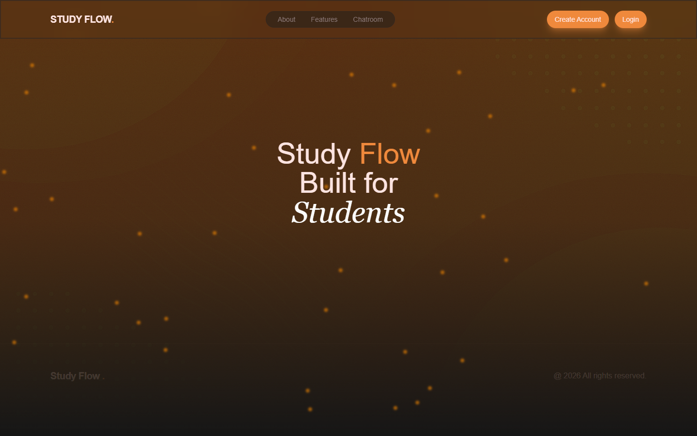
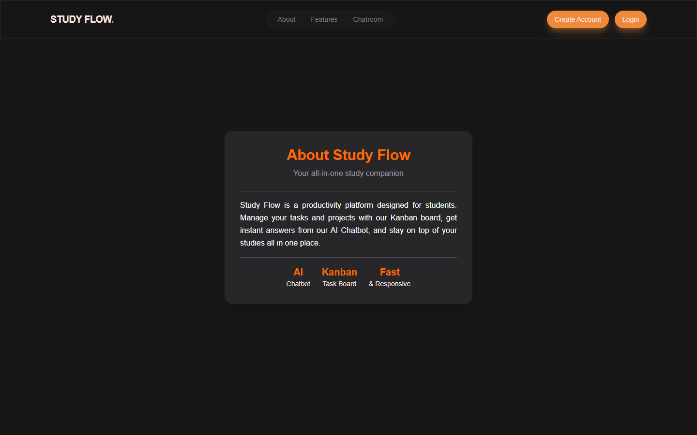
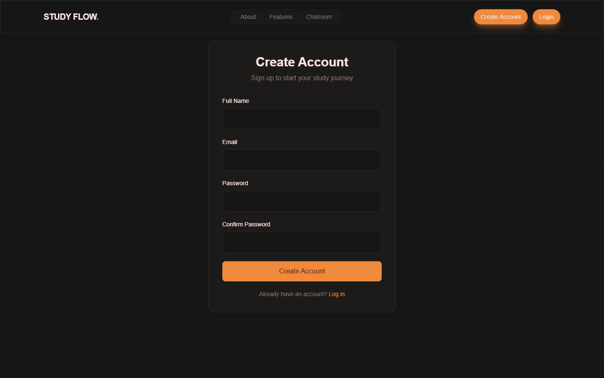
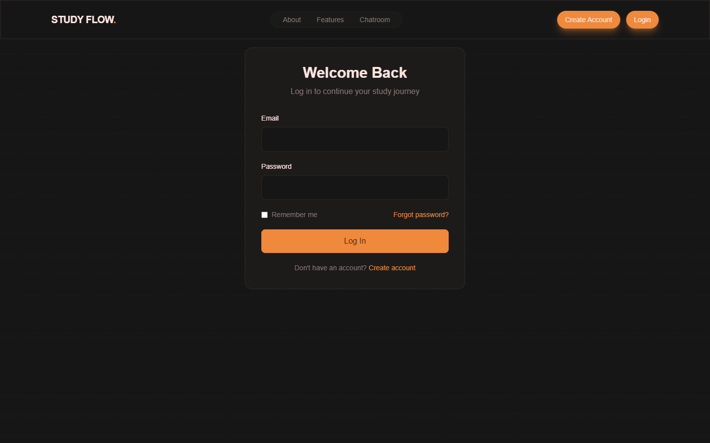
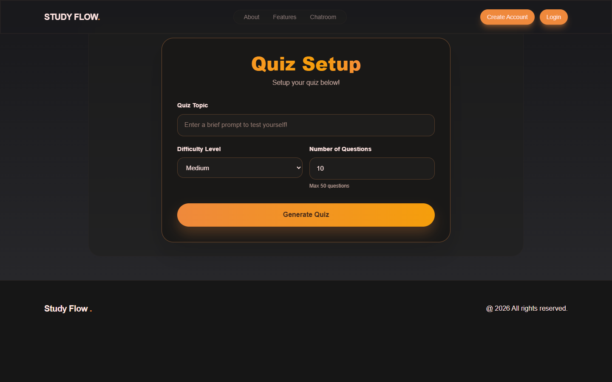
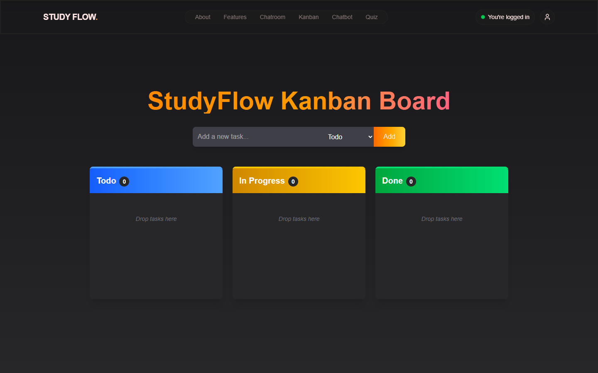
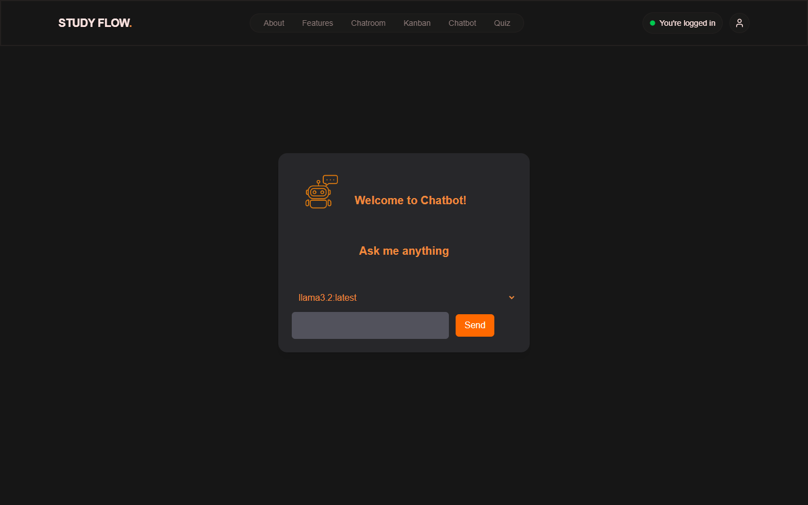
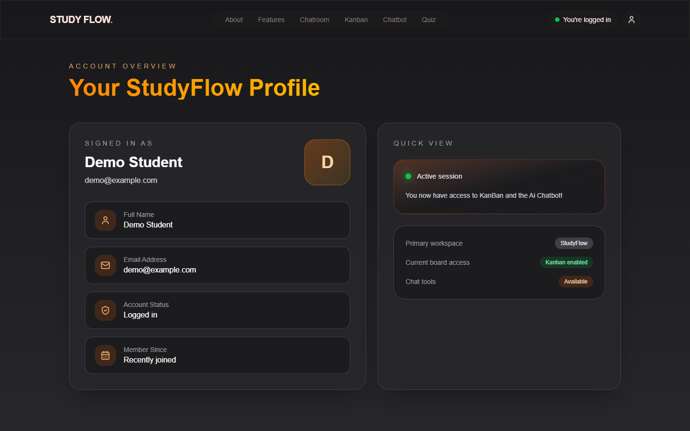

# Study Flow

**Study Flow** is a productivity web app for students. It brings a Kanban task board, an AI chatbot, an AI-generated quiz tool and a real-time chatroom together in one place.

**Team (Group A):** Michael Flanagan, Tony Nicoletti, Ryan Farrell, Oisin Godden



---

## Features

| Feature | Route | Login required | Backed by |
|---|---|---|---|
| Landing page | `/` | No | – |
| About | `/about` | No | – |
| Create account / Log in | `/create-account`, `/login` | No | Express + MongoDB (scrypt-hashed passwords) |
| AI Quiz Generator | `/quiz` | No | Google Gemini (`/api/generate-quiz`) |
| Kanban board | `/kanban` | Yes | MongoDB (`/api/assignments`) |
| AI Chatbot | `/chatbot` | Yes | Local Ollama model (`/api/chat`) |
| Account profile | `/account` | Yes | Browser `localStorage` session |
| Chatroom | `/chat.html` | No | Socket.IO + MongoDB |

## Screenshots

### Home


### About


### Create account


### Log in


### AI Quiz Generator
Pick a topic, a difficulty and a number of questions (1–50). Gemini writes multiple-choice questions, with an explanation for each answer.



### Kanban board
Add tasks and drag them between **Todo**, **In Progress** and **Done**.



### AI Chatbot
Chat with a local LLM through Ollama (default model `llama3.2:latest`).



### Account


---

## Tech stack

- **Frontend:** React 19, Vite 7, Tailwind CSS 4, React Router 7, lucide-react
- **Backend:** Node.js, Express, Mongoose (MongoDB Atlas), Socket.IO
- **AI:** Google Gemini (`@google/generative-ai`) for quizzes, Ollama for the chatbot

## Project structure

```
├── src/                    React frontend
│   ├── App.jsx             Routes + ProtectedRoute
│   ├── Chatbot.jsx         AI chatbot page
│   ├── components/         Buttons + QuizGenerator components
│   ├── layout/             Navbar, Footer
│   └── sections/           Hero, About, Login, CreateAccount, Kanban, Account, QuizSection
├── services/
│   └── geminiaiService.js  Client-side quiz API wrapper (with fallback questions)
├── server/                 Main API server (port 3001)
│   ├── index.js            Auth, assignments, chat, quiz, Socket.IO, static hosting
│   └── models/Message.js
├── server.js               Legacy standalone chat server (port 3000)
├── chat.html               Socket.IO chatroom page
├── public/images/          Static images
└── docs/screenshots/       README screenshots
```

## Getting started

### Prerequisites

- Node.js 20+ (tested with Node 24)
- A MongoDB Atlas connection string
- A Google Gemini API key (for the quiz generator)
- *(Optional)* [Ollama](https://ollama.com) running on `localhost:11434` with a model pulled (e.g. `ollama pull llama3.2`), for the chatbot

### 1. Install dependencies

```bash
npm install
npm --prefix server install
```

### 2. Configure environment

Create `server/.env` (it is git-ignored):

```env
MONGODB_URI=mongodb+srv://<user>:<password>@<cluster>/<db>
GEMINI_API_KEY=your-gemini-api-key
# Optional
GEMINI_MODEL=gemini-2.5-flash
GEMINI_FALLBACK_MODEL=
PORT=3001
```

### 3. Run in development

Run the API and the frontend in two terminals:

```bash
npm run dev:server   # API on http://localhost:3001 (nodemon)
npm run dev          # Frontend on http://localhost:5173
```

Vite proxies `/api/*` to `http://localhost:3001`.

> **Frontend only:** `npm run dev` works without the backend. You can browse every page, but sign-up, login, the Kanban data, quizzes and the chatbot need the API. Without the API, the quiz generator shows built-in fallback questions.

### 4. Run as one app (production-style)

```bash
npm run one-link
```

This builds the frontend into `dist/`, and the Express server serves it, along with `chat.html` and the API, from **http://localhost:3001**.

## Scripts

| Script | What it does |
|---|---|
| `npm run dev` | Start the Vite dev server |
| `npm run dev:server` | Start the API server with nodemon |
| `npm run dev:all` | Start the API and the frontend together (needs a POSIX `sh`) |
| `npm run dev:chat` | Start the legacy standalone chat server (`server.js`, port 3000) |
| `npm run build` | Build the frontend into `dist/` |
| `npm run one-link` | Build, then serve everything from the API server |
| `npm run lint` | Run ESLint |
| `npm run preview` | Preview the production build |

## API reference

| Method | Endpoint | Description |
|---|---|---|
| `GET` | `/health` | Health check |
| `POST` | `/api/auth/register` | Create an account `{ fullName, email, password }` |
| `POST` | `/api/auth/login` | Log in `{ email, password }` |
| `GET` | `/api/assignments` | List Kanban tasks |
| `POST` | `/api/assignments` | Create a Kanban task |
| `DELETE` | `/assignment/:id` | Delete a Kanban task |
| `POST` | `/api/chat` | Send a message to Ollama `{ model, text }` |
| `POST` | `/api/generate-quiz` | Generate a quiz `{ topic, numQuestions, difficulty }` |
| `GET` | `/api/quiz-test` | Quiz API smoke test |

**Socket.IO events:** `joinConversation(conversationId)`, `sendMessage({ conversationId, sender, text })` → broadcasts `newMessage`.
